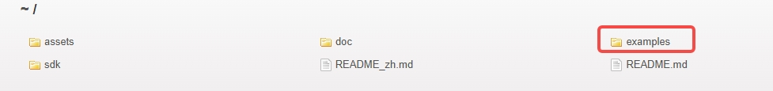
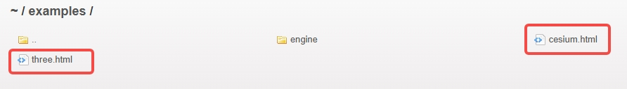

# LCC Web SDK

# [中文文档](README_zh.md)

# Overview
LCC Web SDK is the official development kit provided by Xgrids, enabling the loading of LCC files on the web and rendering data into scenes. It supports common functionalities such as raycasting, point cloud switching, environment data switching, and detailed rendering. Compatible with major browsers: Chrome, Firefox, Safari, Edge.

# How to get?

Please visit [https://developer.xgrids.com/#/download?page=LCC_WEB_SDK](https://developer.xgrids.com/#/download?page=LCC_WEB_SDK) to download the latest development kit, including SDK and samples.

In addition, the test data used in the examples code can be downloaded from [Sample Data](https://developer.xgrids.com/#/download?page=sampledata) and put into the `your_sdk_path/assets` directory after downloading.

# Run exmaples

Before you begin, make sure you have installed the Node.js development environment, make sure `sample data` has been downloaded, and that the path is consistent with `dataPath` in the code.

Then open a terminal, such as **Windows PowerShell** on Windows. 
Next, you need to enter the commands as follows.

**step1**: Enter the root directory of sdk.
``` shell
cd your_sdk_path/
```

**step2**: Install the `live-server` command-line tool. 
``` shell
npm i -g live-server
```

**step3**: Start the `live-server` server.
``` shell
live-server --cors
```

**step4**: In the opened browser, click the sample page you want to run. For example, click the **three.html** item to run the **threejs** sample.        



# Support

Developer documentation: https://developer.xgrids.com/#/document?titleId=en-1720509291851   
Developer forum: https://developer.xgrids.com/#/forum   
Video tutorial: https://developer.xgrids.com/#/tutorial?page=web_sdk 
